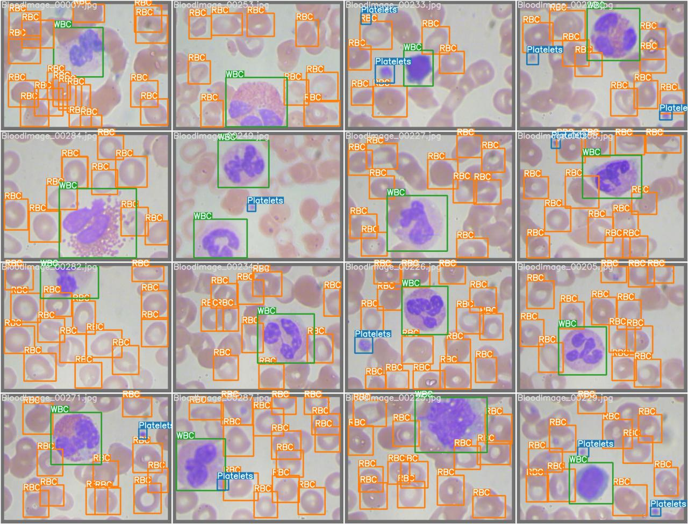

# BCCD 细胞检测（基于Yolo7）

## 一、环境说明

```
Windows10\16G\3060Ti
python3.7.9
torch=1.12.1
CUDA=11.3.1
```

## 二、依赖库说明

```
numpy
lxml
sklearn
opencv-contrib-python
matplotlib
...
```

## 三、对模型源文件的修改
这里直接跳过好像也可以...
### 1、yolov7/train.py

```
518行加上：torch.cuda.empty_cache()
```

### 2、yolov7/utils/datasets.py

将这个函数替换一下，主要是把assert的几个改一下

```python
def cache_labels(self, path=Path('./labels.cache'), prefix=''):
        # Cache dataset labels, check images and read shapes
        x = {}  # dict
        nm, nf, ne, nc = 0, 0, 0, 0  # number missing, found, empty, duplicate
        pbar = tqdm(zip(self.img_files, self.label_files), desc='Scanning images', total=len(self.img_files))
        for i, (im_file, lb_file) in enumerate(pbar):
            try:
                # verify images
                im = Image.open(im_file)
                im.verify()  # PIL verify
                shape = exif_size(im)  # image size
                segments = []  # instance segments
                #assert (shape[0] > 9) & (shape[1] > 9), f'image size {shape} <10 pixels'
                assert im.format.lower() in img_formats, f'invalid image format {im.format}'

                # verify labels
                if os.path.isfile(lb_file):
                    nf += 1  # label found
                    with open(lb_file, 'r') as f:
                        l = [x.split() for x in f.read().strip().splitlines()]
                        if any([len(x) > 8 for x in l]):  # is segment
                            classes = np.array([x[0] for x in l], dtype=np.float32)
                            segments = [np.array(x[1:], dtype=np.float32).reshape(-1, 2) for x in l]  # (cls, xy1...)
                            l = np.concatenate((classes.reshape(-1, 1), segments2boxes(segments)), 1)  # (cls, xywh)
                        l = np.array(l, dtype=np.float32)
                    if len(l):
                        #assert l.shape[1] == 5, 'labels require 5 columns each'
                        #assert (l >= 0).all(), 'negative labels'
                        #assert (l[:, 1:] <= 1).all(), 'non-normalized or out of bounds coordinate labels'
                        #assert np.unique(l, axis=0).shape[0] == l.shape[0], 'duplicate labels'
                        pass
                    else:
                        ne += 1  # label empty
                        l = np.zeros((0, 5), dtype=np.float32)
                else:
                    nm += 1  # label missing
                    l = np.zeros((0, 5), dtype=np.float32)
                x[im_file] = [l, shape, segments]
            except Exception as e:
                nc += 1
                print(f'{prefix}WARNING: Ignoring corrupted image and/or label {im_file}: {e}')

            pbar.desc = f"{prefix}Scanning '{path.parent / path.stem}' images and labels... " \
                        f"{nf} found, {nm} missing, {ne} empty, {nc} corrupted"
        pbar.close()

        if nf == 0:
            print(f'{prefix}WARNING: No labels found in {path}. See {help_url}')

        x['hash'] = get_hash(self.label_files + self.img_files)
        x['results'] = nf, nm, ne, nc, i + 1
        x['version'] = 0.1  # cache version
        torch.save(x, path)  # save for next time
        logging.info(f'{prefix}New cache created: {path}')
        return x
```

### 3、yolov7/utils/loss.py

```
685行改为：from_which_layer.append((torch.ones(size=(len(b),)) * i).to('cuda'))
```
## 四、说明

这个是课堂上的小作业，作业内容为复现一个demo，完成这个仅为学习用途，借鉴了很多人的代码，这里不一一列举了，git后直接打开jupter文件运行即可

## 五、结果展示

